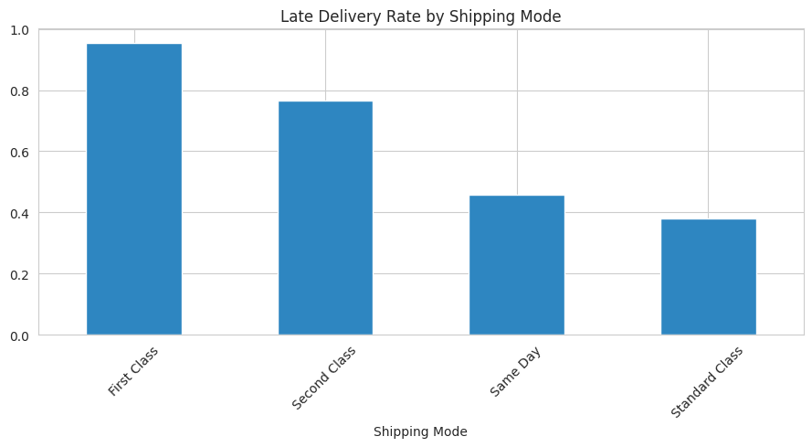
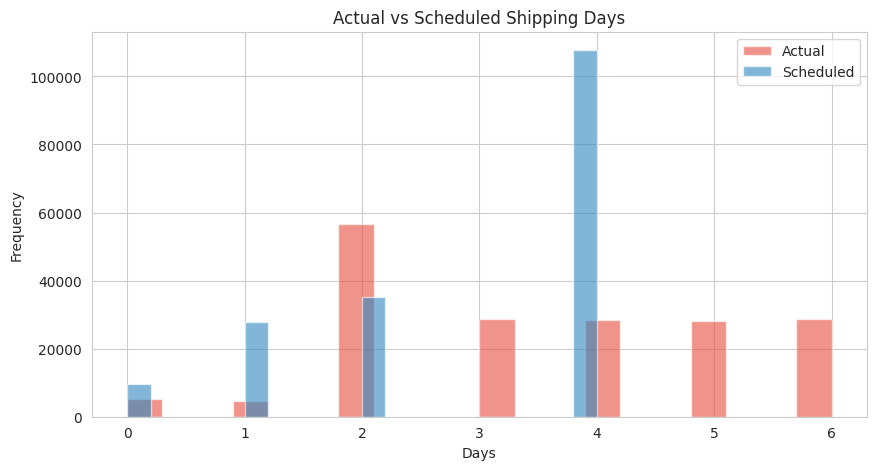
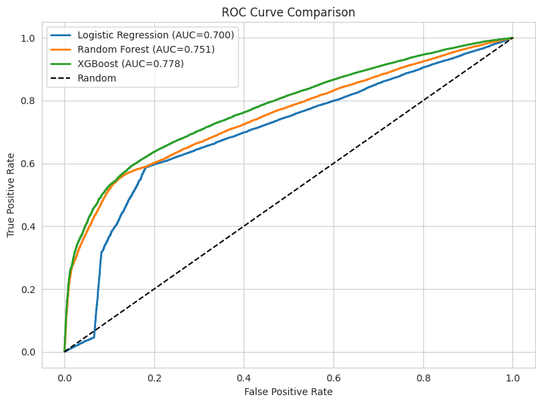
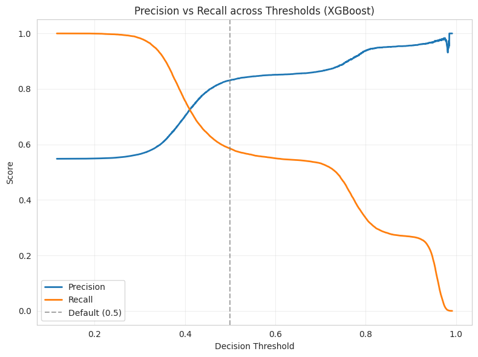
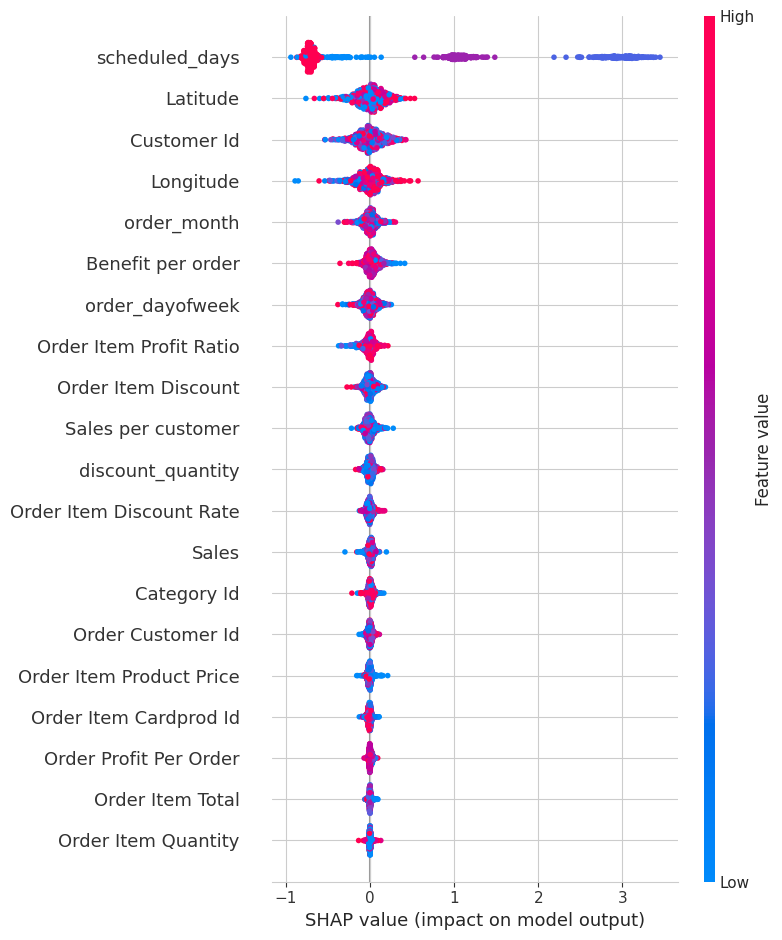
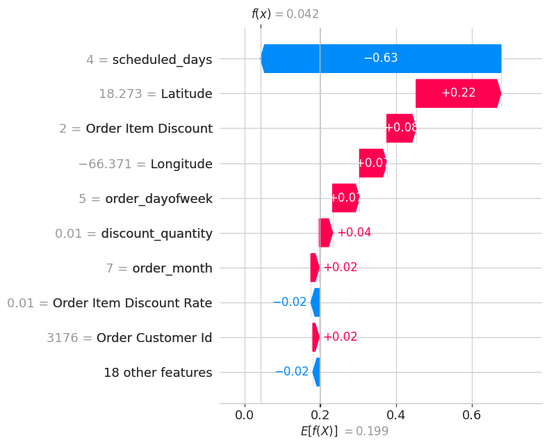

# DataCo Supply Chain: Late Delivery Risk & Shipping Time Prediction

[](https://colab.research.google.com/github/Leo5436/dataco-supply-chain-prediction/blob/main/Supply_Chain.ipynb)
[](https://github.com/Leo5436/dataco-supply-chain-prediction/actions/workflows/ci.yml)


An end-to-end machine learning project on **180K+ real-world supply chain orders**: from exploratory analysis and leakage-aware preprocessing to business-driven threshold selection, hyperparameter optimization, cross-validated evaluation, and SHAP explainability — finishing with persisted, ready-to-serve model artifacts.

---

## Business Problem

Late deliveries erode customer trust and trigger costly downstream disruptions across the supply chain. In this dataset, **~55% of orders arrive late**, making proactive risk detection a high-impact use case.

Two complementary models are built from order-time information only:

1. **Classification** — flag orders at risk of late delivery *at order placement*, so operations teams can intervene early (expedite, re-route, or reset customer expectations).
2. **Regression** — forecast the actual number of shipping days to support more reliable delivery promises.

## Highlights

- **ROC-AUC 0.778 → 0.814** on the classification task after hyperparameter tuning, with **5-fold cross-validation confirming stability (0.813 ± 0.002)**.
- **Decision threshold aligned to a business requirement** — catch at least 80% of late orders — rather than defaulting to 0.5.
- **Shipping duration predicted within ~0.94 days (MAE)** by the best regressor.
- **Leakage-aware pipeline**: post-hoc fields removed, PII stripped, and every design choice documented in the notebook.
- **SHAP explainability** translates model behavior into insights that non-technical stakeholders can act on.
- **Automated CI pipeline** (GitHub Actions) lints the code, runs contract tests on the persisted artifacts, and re-executes the entire notebook end-to-end on every push.

## Dataset

[DataCo Smart Supply Chain](https://www.kaggle.com/datasets/shashwatwork/dataco-smart-supply-chain-for-big-data-analysis) — real transactional data from DataCo Global: **180,519 orders × 53 columns** spanning provisioning, production, sales, and distribution.

## Exploratory Analysis

Late-delivery rates vary sharply by shipping mode and region, and actual shipping times regularly overshoot the scheduled window — the gap the models are built to predict.

<p align="center">
  
  
</p>

## Approach

The notebook walks through the full pipeline:

1. **Data audit & EDA** — distributions, class balance (54.8% late), late-rate breakdowns by shipping mode and region.
2. **Data cleaning** — handled latin-1 encoding, imputed missing values (median / mode), and dropped columns with >30% missingness.
3. **Leakage prevention** — removed `Delivery Status` and actual shipping days from the classification features: these are outcomes, not order-time information.
4. **PII removal** — customer emails, passwords, names, and street addresses dropped before modeling.
5. **Feature engineering** — discount × quantity interaction, unit price, and time-based features (order month, quarter, day-of-week); high-cardinality categoricals (>50 unique values) removed before one-hot encoding (final matrix: 175 features).
6. **Model benchmarking** — Logistic Regression (with standardization), Random Forest, and XGBoost compared on a stratified 80/20 split.
7. **Business-driven threshold tuning** — precision–recall trade-off analyzed to meet an operational recall target.
8. **Hyperparameter tuning** — `RandomizedSearchCV` (25 candidates × 3-fold CV) over depth, learning rate, estimators, and subsampling.
9. **Cross-validation** — 5-fold CV to verify the results are not an artifact of a single split.
10. **SHAP explainability** — global (beeswarm, bar) and local (waterfall) explanations.
11. **Model persistence** — best models, feature column order, and the chosen decision threshold saved with `joblib` for downstream serving.

## Results

### Classification — Late Delivery Risk

| Model | ROC-AUC |
|-------|---------|
| Logistic Regression | 0.700 |
| Random Forest | 0.751 |
| XGBoost (baseline) | 0.778 |
| **XGBoost (tuned)** | **0.814** |

5-fold cross-validation of the tuned model: **ROC-AUC 0.813 ± 0.002** — consistent performance across all folds.

<p align="center">
  
</p>

### From Metric to Decision: Threshold Tuning

A missed late delivery is costlier than a false alarm, so the default 0.5 threshold is the wrong operating point. Given a business requirement of **catching at least 80% of late orders**, the precision–recall curve identifies a threshold of **0.387**:

| Decision Threshold | Precision (late) | Recall (late) | F1 (late) |
|--------------------|------------------|---------------|-----------|
| 0.50 (default) | 0.83 | 0.59 | 0.69 |
| **0.387 (business target)** | 0.67 | **0.80** | **0.73** |

The chosen threshold trades precision for recall by design — and F1 for the late class actually *improves*. The threshold itself is saved alongside the model as a deployable artifact.

<p align="center">
  
</p>

### Regression — Shipping Days

| Model | RMSE | MAE | R² |
|-------|------|-----|-----|
| Linear Regression | 1.39 | 1.13 | 0.270 |
| **Random Forest (best)** | **1.21** | **0.94** | **0.445** |
| XGBoost (baseline) | 1.25 | 1.00 | 0.405 |
| XGBoost (tuned) | 1.25 | 0.99 | 0.409 |

5-fold cross-validation of the Random Forest: **R² 0.441 ± 0.005**. Tuning barely moved XGBoost on this task, so Random Forest was kept as the final regressor — evidence that **no single model wins across tasks**, and that tuning effort should follow the data rather than habit.

## Model Explainability (SHAP)

<p align="center">
  
</p>

**What drives late-delivery risk:**

- **The scheduled shipping window (`scheduled_days`) dominates every other feature.** Orders with short promised windows (low values, blue) receive strongly positive SHAP values — **tight delivery promises are the ones that slip**. Because the scheduled window is set by the shipping mode, this single feature effectively absorbs the shipping-mode signal.
- **Geography matters**: latitude and longitude rank next, indicating regional differences in logistics performance — consistent with the regional late-rate patterns seen in EDA.
- **Temporal features contribute**: order month and day-of-week carry signal, suggesting seasonal and weekly load effects.
- **A candid observation**: `Customer Id` also ranks high, meaning the model partially keys on customer-level patterns through an ID column — a known limitation worth controlling for in production settings.

SHAP waterfall plots explain **individual order predictions**, showing exactly which factors pushed a specific order toward "late" — the kind of per-case reasoning operations teams need in order to trust and act on a model's output:

<p align="center">
  
</p>

## Key Takeaways

- **Start from the business question, not the metric.** The threshold analysis converts an abstract ROC-AUC into an operating point that meets a concrete operational target (80% recall on late orders).
- **Guard against leakage before optimizing anything.** Removing post-hoc fields keeps the reported performance honest and achievable at prediction time.
- **Validate that gains are real.** Hyperparameter tuning added +0.036 ROC-AUC, and 5-fold CV (±0.002) confirms the improvement is stable rather than split luck.
- **Explainability is a deliverable, not an afterthought.** SHAP turns the model into a communicable story: tight schedules, geography, and timing drive risk.

## Repository Structure

```
├── .github/workflows/ci.yml   # Lint · artifact tests · end-to-end notebook run
├── Supply_Chain.ipynb         # Full pipeline: EDA → cleaning → features → models
│                              # → threshold → tuning → CV → SHAP → persistence
├── tests/test_artifacts.py    # Contract tests for the persisted model artifacts
├── data/sample_orders.csv     # 3,000-row sample so CI can run without Kaggle
├── images/                    # Exported figures used in this README
├── xgb_late_delivery.pkl      # Tuned classifier
├── xgb_shipping_days.pkl      # Tuned regressor
├── feature_columns.pkl        # Training-time column order (schema contract)
├── threshold.pkl              # Business-selected decision threshold (0.387)
├── requirements.txt           # Runtime dependencies
├── requirements-dev.txt       # Lint / test / notebook execution dependencies
└── pyproject.toml             # Ruff configuration
```

### Running it yourself

**On Colab (full dataset):** click the **Open in Colab** badge above, download the dataset from [Kaggle](https://www.kaggle.com/datasets/shashwatwork/dataco-smart-supply-chain-for-big-data-analysis) into your Drive, and run all cells. The notebook auto-detects Colab and mounts Drive; override the location with the `DATA_PATH` environment variable if your path differs.

**Locally (bundled sample):**

```bash
pip install -r requirements-dev.txt
pytest -v                       # artifact contract tests
jupyter nbconvert --to notebook --execute Supply_Chain.ipynb
```

With no environment variables set, the notebook falls back to `data/sample_orders.csv`, so it runs out of the box without a Kaggle account.

## Continuous Integration

Every push to `main` and every pull request triggers a GitHub Actions
workflow with three checks:

1. **Lint** — Ruff enforces code quality across both `.py` files and the
   training notebook.
2. **Artifact contract tests** — pytest verifies that the persisted model, the
   saved feature-column order, and the decision threshold stay mutually
   consistent, and that the model still returns a valid probability when fed a
   request shaped the way a serving layer would send it. This includes an
   automated guard asserting that leakage columns never reappear in the feature
   set — so the honesty of the pipeline is enforced by tests, not by memory.
3. **End-to-end notebook execution** — the full pipeline is re-run from a clean
   runner on a 3,000-row stratified sample, confirming the notebook is
   reproducible top-to-bottom and does not depend on leftover kernel state.

The notebook is parameterized via environment variables (`DATA_PATH`,
`SEARCH_N_ITER`, `CV_FOLDS`), so the same code runs unmodified on Colab with the
full 180K-row dataset and on CI with the lightweight sample.

## Tech Stack

Python · Pandas · NumPy · scikit-learn · XGBoost · SHAP · SciPy · Matplotlib · Seaborn · joblib · pytest · Ruff · GitHub Actions

## Next Steps

- **Streamlit app** (in progress): interactive risk scoring for new orders, served from the persisted model, feature schema, and business threshold — the artifact contract tests above already cover the interface it will consume.
